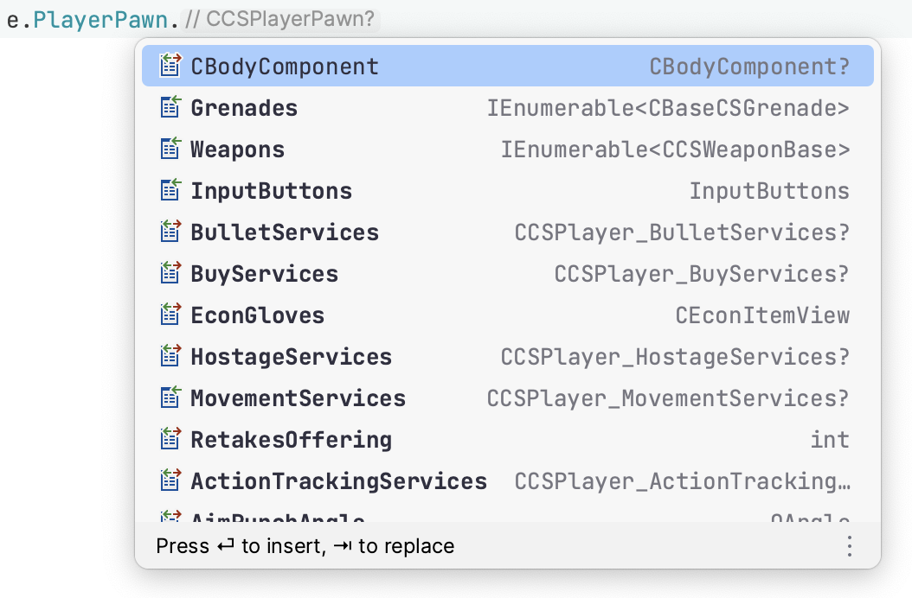

# DemoFile.Net  

DemoFile.Net is a blazing fast demo parser library for Counter-Strike 2, written in C#. It is cross platform, and can be
used from Windows, Mac or Linux.


Easy discoverability of available data through your IDE's inbuilt autocompletion:

|  |  |
|-------------------------|-------------------------|
|  |  |

## Features

| Feature                                           | Availability      |
|---------------------------------------------------|-------------------|
| CSTV / GOTV demos                                 | ✅ Full support    |
| POV demos                                         | ➖ Support planned |
| Game events (e.g. `player_death`)                 | ✅ Full support    |
| Entity updates (player positions, grenades, etc.) | ✅ Full support    |

## Examples

> Note:
> This library is still under heavy development and the API is likely to change significantly before v1.0

```c#
using DemoFile;

internal class Program
{
    public static async Task Main(string[] args)
    {
        var path = args.SingleOrDefault() ?? throw new Exception("Expected a single argument: <path to .dem>");

        var demo = new DemoParser();
        demo.Source1GameEvents.PlayerDeath += e =>
        {
            Console.WriteLine($"{e.Attacker?.PlayerName} [{e.Weapon}] {e.Player?.PlayerName}");
        };

        await demo.ReadAllAsync(File.OpenRead(path));

        Console.WriteLine("\nFinished!");
    }
}
```

See also the [examples/](./examples) folder.

## Benchmarks

On an M1 MacBook Pro, DemoFile.Net can read a full competitive game (just under 1 hour of game time) in 1.5 seconds.
This includes parsing all entity data (player positions, velocities, weapon tracking, grenades, etc).

| Method    | Runtime  |        Mean |    Error |   StdDev |
|-----------|----------|------------:|---------:|---------:|
| ParseDemo | .NET 8.0 | **1.501 s** | 0.0047 s | 0.0042 s |

## Author and acknowledgements

DemoFile.Net is developed by [Saul Rennison](https://saul.re). The development of this library would not have been
possible without [demoparser by LaihoE](https://github.com/LaihoE/demoparser)
and [Manta by Dotabuff](https://raw.githubusercontent.com/dotabuff/manta/master/README.md), the latter of which depends
on the efforts of a number of people:

- [Michael Fellinger](https://github.com/manveru) built Dotabuff's Source 1
  parser [yasha](https://github.com/dotabuff/yasha).
- [Robin Dietrich](https://github.com/invokr) built the C++ parser [Alice](https://github.com/AliceStats/Alice).
- [Martin Schrodt](https://github.com/spheenik) built the Java parser [clarity](https://github.com/skadistats/clarity).
- [Drew Schleck](https://github.com/dschleck) built an original C++ parser [edith](https://github.com/dschleck/edith).

A modified version of [Source2Gen by neverlosecc](https://github.com/neverlosecc/source2gen) is used to statically
generate the game schema classes and enums.

See [ACKNOWLEDGEMENTS](./ACKNOWLEDGEMENTS) for license information.
